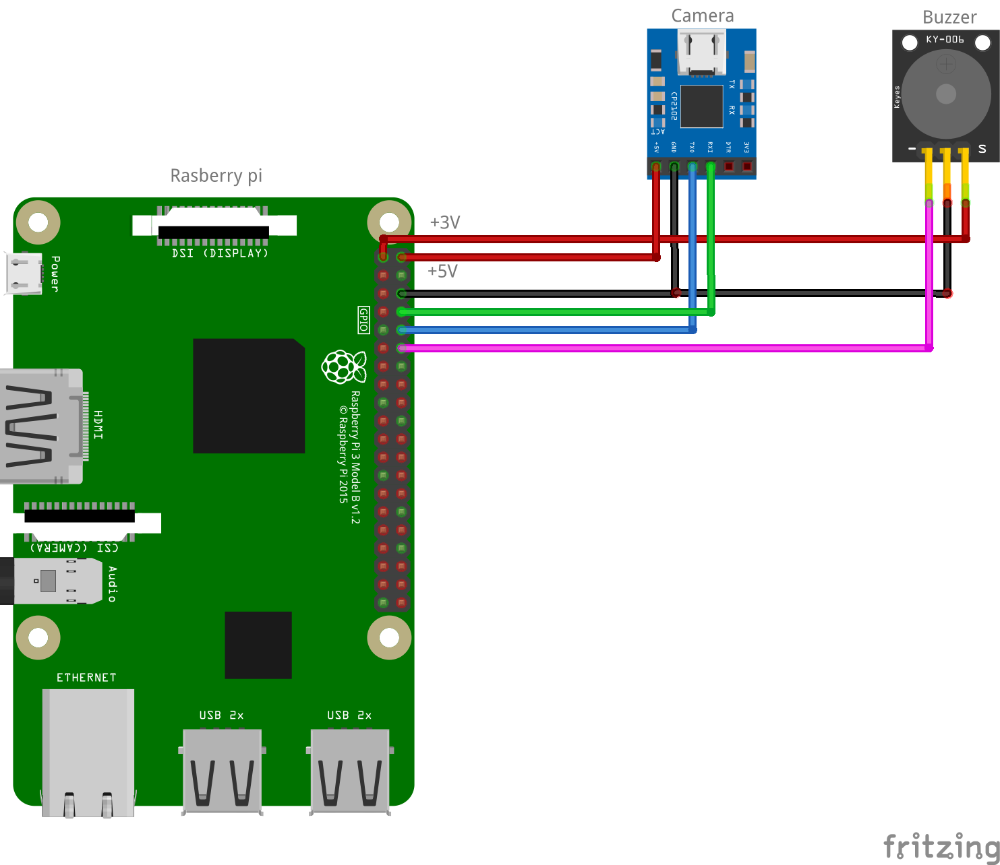

# 📍 Présence Scanner QR Code

Projet de 2ème année à l'ESIEA, dans le cadre du PST (Projet Scientifique et
Technique).

L'objectif principal de ce projet est de faciliter le relevé des présences
en classe : chaque élève dispose d'un QR code personnel qu'il scanne à l'aide
d'un lecteur à l'entrée de la salle. Les informations récupérées sont ensuite
enregistrées dans une base de données et transmises à un serveur Hyperplanning
afin que l'enseignant puisse visualiser rapidement les absents.

Ce dépôt contient les différentes parties du projet :

- Le site web
- Les fichiers à installer sur le Raspberry Pi 3B
- Le modèle 3D du boîtier

---

# 🧰 Prérequis

## 🔩 Partie matérielle

- Raspberry Pi 3 Model B 1GB : https://fr.farnell.com/en-FR/raspberry-pi/raspberrypi3-modb-1gb/sbc-raspberry-pi-3-mod-b-1gb-ram/dp/2525225
- Lecteur QR Code SEN0486 : https://www.gotronic.fr/art-lecteur-de-qr-code-sen0486-34640.htm
- Écran tactile 5" DFR0550-V2 compatible Raspberry Pi SBC https://fr.farnell.com/en-FR/dfrobot/dfr0550-v2/touchscreen-display-5-size-rpi/dp/4733226?MER=BR-MER-PDP-RECO-STM72194

## 🖨️ Impression 3D

Possibilité d'imprimer en PLA, mais pour une meilleure 
solidité, veuillez privilégier l'ABS ou l'ASA.


Taille : 179.998 x 149.998 x 80 mm ;
Volume : 304598 mm3

## 🌐 Partie serveur

- Une machine capable d'exécuter Docker
- Un serveur Hyperplanning accessible via API WSDL


### 🔗 Accès à l'API Hyperplanning

Ce projet utilise l'API WSDL native d’Hyperplanning.

Pour vérifier que l'API est accessible :

```
https://urlSiteHyperplanningAPI.com/hpsw/wsdl
```

---

# 📦 Boîtier

## 🔌 Câblage

L'écran se connecte via le port DSI du Raspberry Pi.

### 📷 Lecteur QR Code

- VCC → Pin 2 (5V)
- GND → Pin 6 (GND)
- TX → Pin 10 (RX / GPIO15)
- RX → Pin 8 (TX / GPIO14)

### 🔊 Buzzer

- VCC → Pin 1 (3.3V)
- GND → Pin 14 (GND)
- I/O → Pin 12 (GPIO18)




## 🧱 Boîtier 3D

Le modèle 3D du boîtier est disponible dans le dossier `3D`.

## ⚙️ Installation Boîtier

Tout d'abord, copier/coller le dossier ``harware`` dans le rasberry pi

### 1. Dépendances système

```bash
sudo apt update
sudo apt install -y python3 python3-pip libsdl2-dev libsdl2-ttf-dev wiringpi gcc
```

> Sur les Raspberry Pi OS récents, `wiringpi` n'est plus dans les dépôts officiels : il faut alors l'installer depuis [le repo GitHub officiel de WiringPi](https://github.com/WiringPi/WiringPi).

### 2. Dépendances Python

```bash
pip3 install -r requirements.txt --break-system-packages
```

### 3. Activer l'UART

```bash
sudo raspi-config
```

Interface Options → Serial Port → désactiver la console série, activer le matériel série → redémarrer.

### 4. Compiler le programme

```bash
gcc main.c -o scanner -lwiringPi -lSDL2 -lSDL2_ttf -lpthread -lm
```

### 5. Configurer les identifiants HyperPlanning

Les identifiants de connexion à l'API (`LOGIN`, `PASS`, `WSDL_URL`) sont définis en haut de `check_presence.py` et `init_absences.py`. Adapte-les à ton instance HyperPlanning.

### 6. Démarrage automatique au boot

Copie `scanner.service` dans `/etc/systemd/system/` en adaptant le `User`, le `WorkingDirectory` et le chemin `ExecStart` à ton installation (vérifie ton UID avec `id <utilisateur>` pour `XDG_RUNTIME_DIR`) :

```bash
sudo cp scanner.service /etc/systemd/system/
sudo systemctl daemon-reload
sudo systemctl enable scanner.service
sudo systemctl start scanner.service
```

Le scanner se lance désormais automatiquement en plein écran à chaque démarrage du Raspberry Pi.

## 🌐 Site Web
### ⚙️ Installation pour le développement

Ce projet utilise Python 3 (minimum recommandé : Python 3.11, compatible avec Python 3.10).

Il est fortement conseillé d'utiliser un environnement virtuel (`venv`) afin d'isoler les dépendances du projet.

#### 📦 Installation des dépendances

Depuis la racine du projet, exécute la commande suivante :

```bash
pip install -r website/requirements.txt
```

#### ⚙️ Configuration des variables d'environnement

Les variables de configuration sont définies dans le fichier ``website/auth.py``.

Veuillez modifier les valeurs suivantes selon votre environnement de développement :

```py
REAL_BASE = os.environ.get(
    "REAL_BASE",
    "https://urlSiteHyperplanningAPI.com"
)  # Remplacer par l'URL locale ou de test

WSDL_URL = REAL_BASE + "hpsw/wsdl"

# Identifiants administrateur (utilisés pour interroger l'API)
ADMIN_LOGIN = os.environ.get("ADMIN_LOGIN", "admin")
ADMIN_PASS = os.environ.get("ADMIN_PASS", "motdepasse")
```

#### ▶️ Lancement en développement

Une fois la configuration terminée, vous pouvez lancer le projet avec :

```py
python website/website.py
```

### ⚙️ Installation pour la production

#### 🐳 Docker
##### Connecter-vous sur votre gitlab sur votre ordinateur
1. Connectez-vous à GitLab
  https://gitlab.esiea.fr/

3. Cliquez sur votre avatar (en haut à droite)
4. Allez dans :
    Preferences → Access Tokens
5. Rempli les champs :
    Name : docker-registry (ou autre)

    Expiration date : optionnel (mais recommandé)

    Scopes à cocher :

    ✅ read_registry

    ✅ write_registry

6. Clique sur Create token

7. Connecte Docker à GitLab :
```bash
docker login registry.esiea.fr
```

Exemple de fichier `docker-compose.yml` :

```yaml
services:
  pstqrcode:
    build: .
    image: registry.esiea.fr/clech/presence_scanner_qrcode:v1
    container_name: website
    ports:
      - "5000:5000"
    env_file:
      - .env
    restart: unless-stopped
```

#### ⚙️ Configuration

Variables d'environnement

Créer un fichier .env :

```.env
ADMIN_LOGIN=admin
ADMIN_PASS=motdepasseadmin
REAL_BASE=https://urlSiteHyperplanningAPI.com
```

## 🚀 Améliorations possibles

Une réflexion est actuellement menée sur la réduction des coûts
du système, notamment à travers l'étude de solutions matérielles et
logicielles alternatives reposant sur des composants moins onéreux, tout
en conservant un niveau de performance et de fiabilité équivalent.

Dans cette optique, les capacités du Raspberry Pi 3B permettent d’envisager
une simplification de l’architecture matérielle. Par exemple, la lecture des
QR codes pourrait être réalisée directement via une caméra standard, plutôt
que par l'utilisation de modules spécialisés transmettant un code déjà interprété.
Cette approche réduirait la complexité globale du système tout en restant
suffisamment performante pour le cas d’usage ciblé.

Par ailleurs, il est important de noter qu’actuellement la connexion au système
présente des lenteurs importantes. Afin d’améliorer l’expérience utilisateur et
de limiter les temps de réponse, la mise en place d’un mécanisme de cache est
envisagée. Celui-ci permettrait de stocker temporairement certaines données
fréquemment utilisées, réduisant ainsi les appels répétés au serveur et améliorant
significativement la fluidité globale du système.

Enfin, plusieurs perspectives d'évolution plus innovantes sont envisagées.
Le système pourrait notamment intégrer des cartes NFC contenant le QR code
associé à l'utilisateur, ou une identification physique équivalente.
Une autre piste consiste au développement d'une application mobile dédiée
permettant d'afficher le QR code directement sur smartphone, à l'image des
solutions déjà utilisées dans les systèmes de cartes étudiantes ou les
portefeuilles numériques (type Apple Wallet).

Le QR code étant unique et lié à chaque utilisateur, ce type d'approche
permettrait une utilisation plus fluide, durable et moderne du dispositif,
tout en limitant les besoins de régénération ou de support physique.

---

# 👥 Contributeurs du projet

- Antoine Balandier
- Anatole Barboux
- Riwal Clech
- Noémie Lenoël

# 👨‍🏫 Encadrement

- Professeur suiveur : M. Pere
